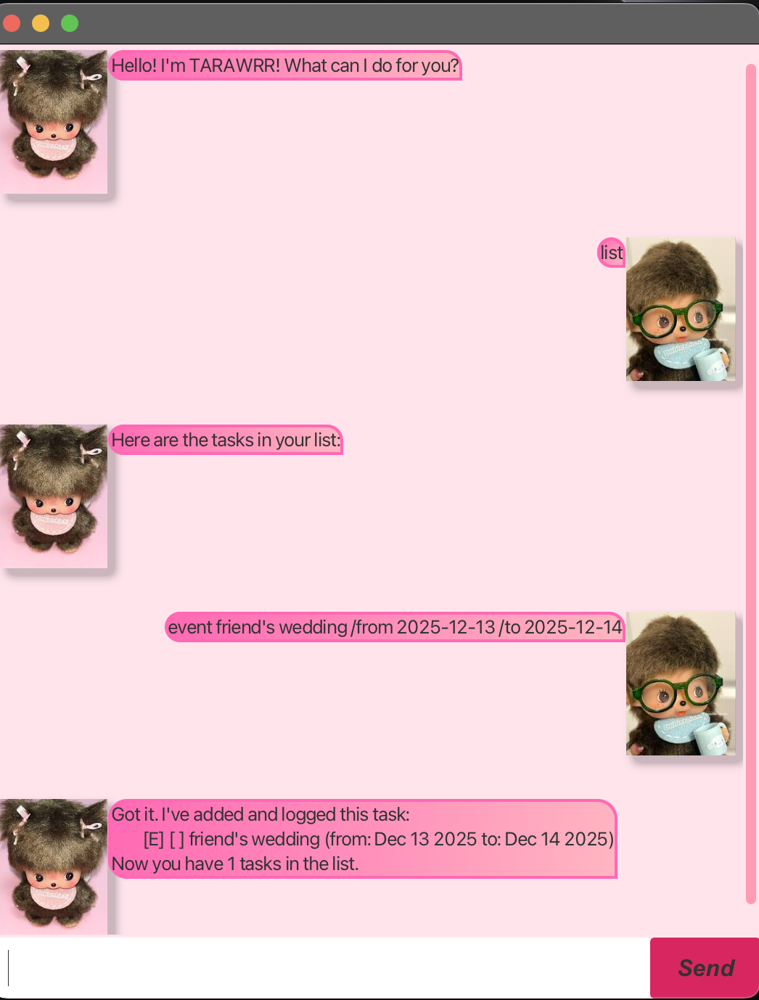

# 💕  Tarawrr User Guide 💕

Hello! I am ✨Tarawrr✨, your task management assistant.
My purpose is to help you organize, track, and complete your tasks efficiently.
I can help you add new items, set deadlines and mark things



## Adding deadlines
To add a deadline task, use the command `deadline` followed by the task description and the due date in the format `/by YYYY-MM-DD`.

Example: `deadline return book /by 2024-10-01`


```
Got it. I've added this task:
  [D][ ] return book (by: Oct 1 2024)
Now you have 1 task in the list.
```

## Adding events
To add an event task, use the command `event` followed by the task description and the event start and end date 
in the format `/from YYYY-MM-DD /to YYYY-MM-DD`.

Example: `event project meeting /from 2024-10-01 /to 2024-10-02`

```
Got it. I've added this task:
  [E][ ] project meeting (from: Oct 1 2024 to: Oct 2 2024)
Now you have 2 tasks in the list.
```

## Adding todos
To add a todo task, use the command `todo` followed by the task description.
Example: `todo read book`

```
Got it. I've added this task:
  [T][ ] read book
Now you have 3 tasks in the list.
```     

## Listing tasks
To view all your tasks, use the command `list`.

```
Here are the tasks in your list:
1.[D][ ] return book (by: Oct 1 2024)
2.[E][ ] project meeting (from: Oct 1 2024 to: Oct 2 2024)
3.[T][ ] read book
```

## Marking tasks as done
To mark a task as done, use the command `done` followed by the task number.

Example: `done 2`
```
Nice! I've marked this task as done:
  [E][X] project meeting (from: Oct 1 2024 to: Oct 2 2024)
``` 

## Unmarking tasks as done
To unmark a task as done, use the command `undone` followed by the task number.

Example: `undone 2`
```
OK, I've marked this task as not done yet:
  [E][ ] project meeting (from: Oct 1 2024 to: Oct 2 2024)
```         

## Deleting tasks
To delete a task, use the command `delete` followed by the task number.

Example: `delete 1`
```
Noted. I've removed this task:
  [D][ ] return book (by: Oct 1 2024)
Now you have 2 tasks in the list.
``` 

## Clearing all tasks
To clear all tasks, use the command `clear`.

```
All tasks have been cleared.
``` 

## Finding tasks
To find tasks containing a specific keyword, use the command `find` followed by the keyword.

Example: `find book`
```
Here are the matching tasks in your list:
1.[T][ ] read book
``` 

## Snoozing tasks
To snooze a task to a later date, use the command `snooze` followed by the task number and the new date 
in the format `/to YYYY-MM-DD`(deadline) and `/to YYYY-MM-DD YYYY-MM-DD`(event).
Example: `snooze 1 /to 2024-10-05` (deadline)

```
Got it. I've snoozed this task:
  [D][ ] return book (by: Oct 5 2024)
```

## Exiting the program
To exit the program, use the command `bye`.

```
Bye. Hope to see you again soon!
```